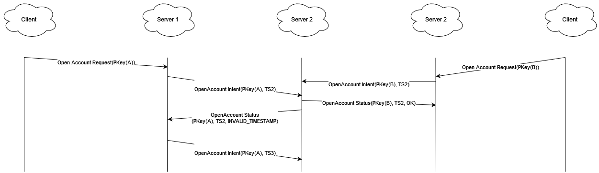

# SEC Project Report 2nd Delivery

This report consists of the changes made for the 2nd Delivery regarding the SEC project, check the report of the 1st Delivery
for more information regarding the system

## Security Design Decisions

The goal was to guarantee consistency among all replicas of the servers, to this end we implemented a (1,N) Byzantine Atomic Register,
like it was suggested in the project statement.

The only changes made were to the server, so the client done in the 1st stage can still be used without the user noticing any change.

## Server Architecture

The server is now composed of two interfaces, the Bank Service, which is the interface the clients use to communicate with the Bank
and the Sync Bank Service, which is the interface responsible to communicate with the other banks to synchronize and coordinate action in
order to maintain the correctness and consistency of the Bank as a whole.

## (1,N) Byzantine Atomic Register Implementation

The (1,N) Byzantine Atomic Register Implementation has 2 different approaches, even thought similar they have their 
differences that are worth mentioning. The differences are present if the operation is a read, or a write.

Read operations:
- Check Account
- Audit

Write operations:
- Open Account
- Send Amount
- Receive Amount

### Read operations

A read operation will send to all replicas, including itself, a request for them to send the content relative to the request (Check Account or Audit)
once the operation has a majority in similar replies, this is, more than 51% of the replies have the same content regarding the Bank, it returns that 
majority reply to the client.

### Write operations

A write operation is more complex than a read operation and is split into 3 phases:
- Intent
- Status
- Applied

#### Intent

In the ***Intent*** phase a replica will send to all other replicas an Intent Request to warn the other replicas that it want to perform a write operation.
The replica will also send that request to itself.

Upon receiving an Intent Request, the replica will send a Status Request which will either be a *SUCCESS*, or an *ERROR_MESSAGE*, to all the other replicas.

#### Status

In the ***Status*** phase, the replica will wait until more than 51% of the statuses it receives are the same, achieving a *STATUS MAJORITY*.

Upon reaching that state, the replica will perform that operation, if the STATUS was a *SUCCESS* and send an Applied Request to all the other replicas
informing that it already and move to the ***Applied*** phase.

#### Applied

In the ***Applied*** phase the replica will wait for more than 51% of the applied requests it receives being the same, achieving a *APPLIED MAJORITY*.

Upong reaching that state the replica will reply to the client with the response to the original request that triggered the *Intent.

Here's a diagram to show a simple Open Account Operation with no faults:

### Timestamps

All the requests are identified with a Timestamp, these are given by the replica that receives the request from the client and then propagates it.

Only one request with a timestamp N will be accepted by the system, if two or more requests have the same timestamp, in the ***STATUS*** phase, the system will
only accept one of them and give an ***INVALID_TIMESTAMP*** error to the other requests. This ensures the order in which the requests are performed to avoid 
inconsistencies along the replicas.

Here's a diagram to show how the system decides which requests get the timestamp in case of a tie

#### Invalid Timestamps

If a server receives an ***INVALID_TIMESTAMP*** error, it will retry to send that request with a higher timestamp in order to perform it.

## Byzantine Servers

Since this system can only perform any operation once at least 51% of the replicas agree on it, the system needs to start
with **2f + 1** servers, where **f** is the number of servers that can fail.

## DOS Protection

Denial of Service protection is implemented by the server only on the functions that require a change of state:
- OpenAccount
- SendAmount
- ReceiveAmount

We implemented DOS protection by blocking the account making the request and not the ip of the attacker just for simplicity. 
We consider a burst of requests to be a DOS attack if it was under 400ms between requests.

## Malicious User

Assuming all the messages are signed, as was our intention, a malicious client cannot impersonate a server, therefore, not
compromising the consistency of the system as a whole.

## Crash Recovery

Even thought a crash recovery of a specific replica is not implemented, this is, if a replica fails and then comes back online,
it won't have any operations done between the time it crashed, and it came back online, the way we would implement it would be
like the read operations we implemented where the replica R (recovery) in question would ask all the other replicas their ledger
and then it would recover its bank from the ledger of the majority, this is, the one most common among all replicas.
It would also adopt the timestamp associated with that ledger.

## Improvements from the 1st Delivery

We implemented a new interactive client and added key stores to the existing code